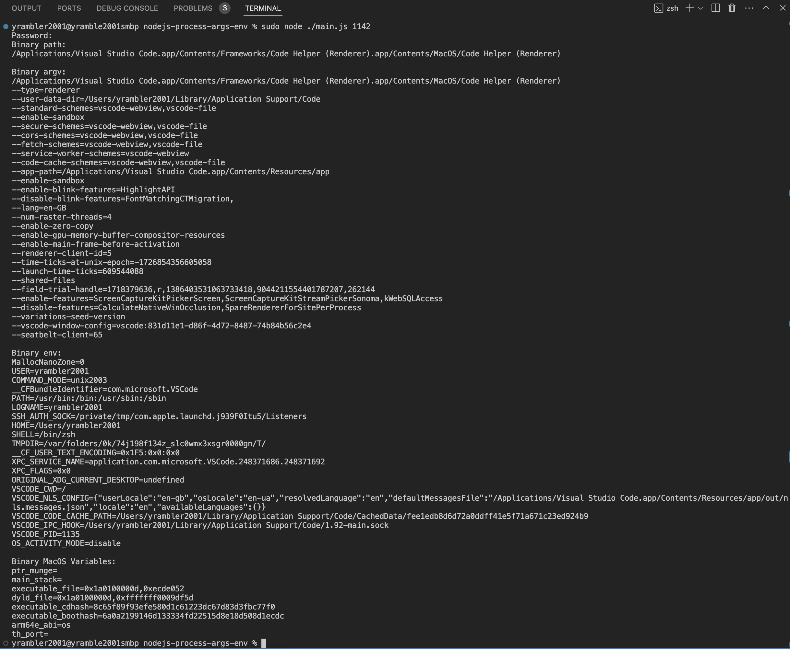
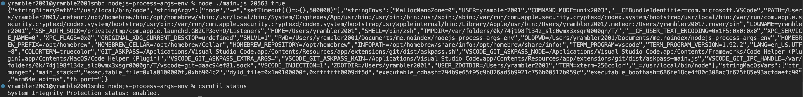

CLI tool to get Process Arguments (argv) and Process Environment Variables with a Process ID

The App is using a Node.JS with a C++ binding to call a sysctl [KERN_PROCARGS2](https://github.com/apple-oss-distributions/xnu/blob/rel/xnu-10063/bsd/kern/kern_sysctl.c#L1319)

Tested on Node.JS v18, MacOS Sonoma v14.5, SIP on.

Setup:

```
npm i
```

Usage:

```
sudo node ./main.js PROCESS_ID
```



Display JSON:

```
sudo node ./main.js PROCESS_ID true
```


